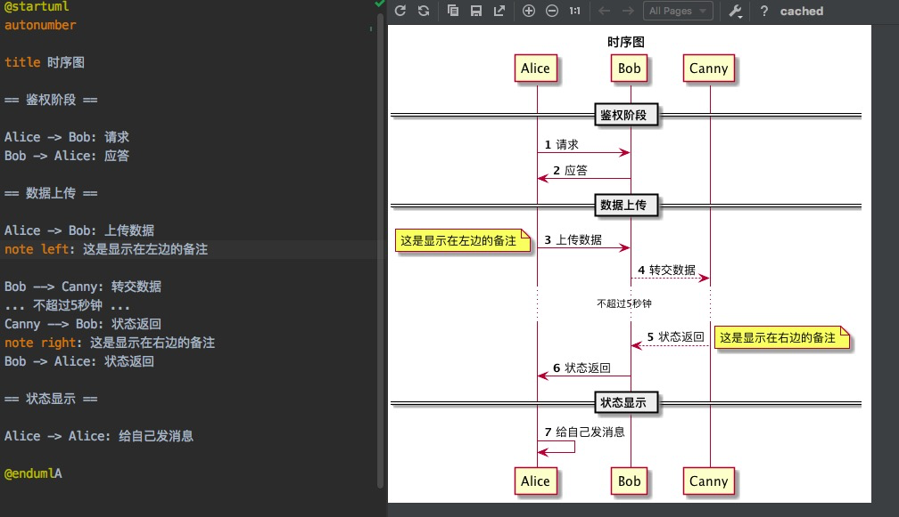
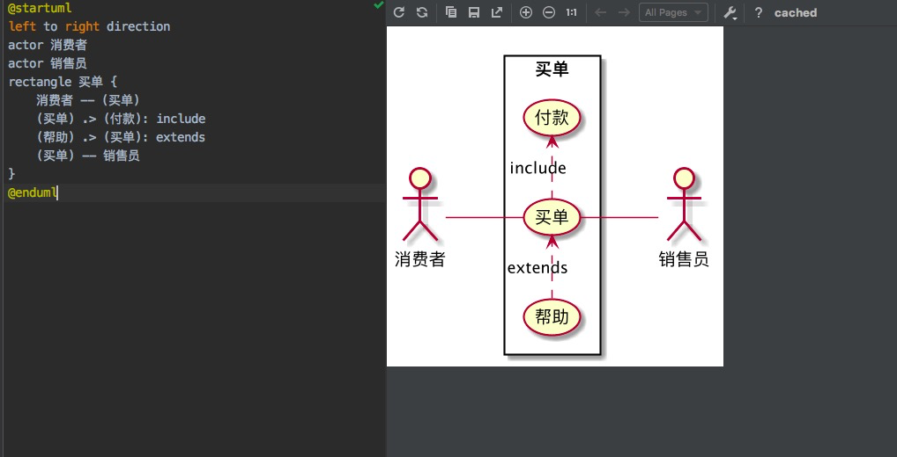
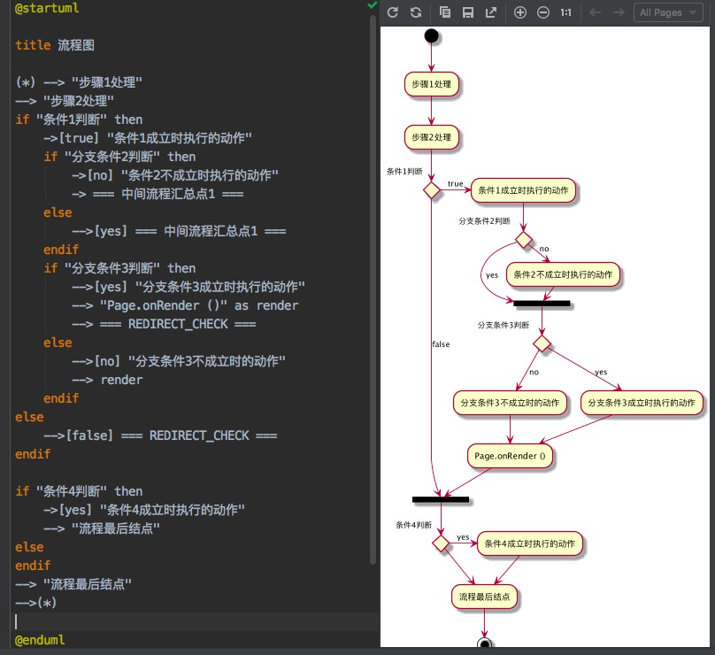
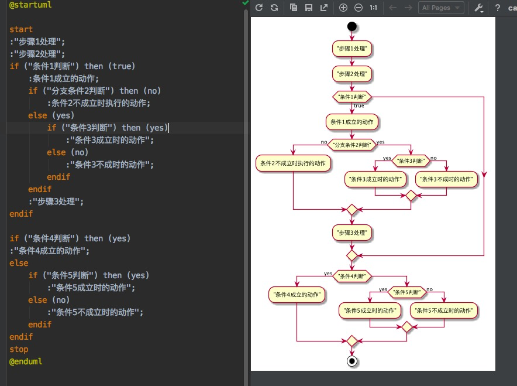
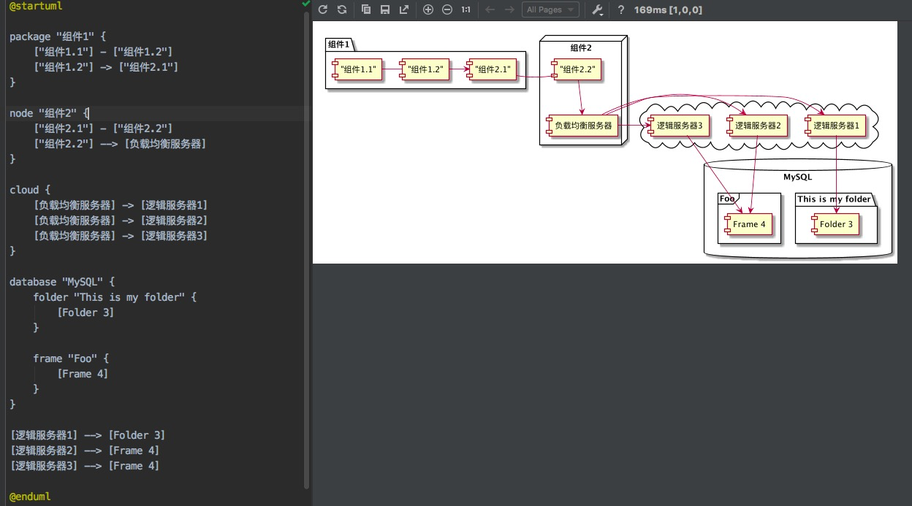
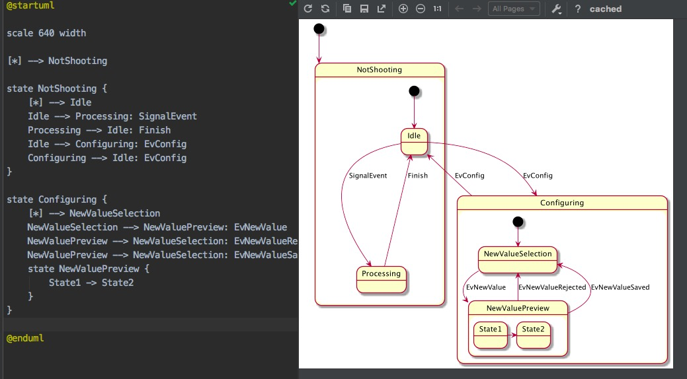

## PlantUML 学习

### 时序图

**Tips:**

- 使用 `title` 来指定标题
- 使用 `autonumber` 来为时序图加上顺序
- `->` 和 `-->` 来指示线条样式, `->` 是实线, `-->` 是虚线
- 在每个时序后面加冒号 `:` 来添加注释
- 使用 `note` 来显示备注, 备注可以指定显示在左边还是右边
- 使用 `== xxx ==` 来分隔时序图
- 使用 `...` 来表示延迟省略号
- 节点可以给自己发送消息, 方法是发送方和接收方使用同一个主题即可

### 用例图

**Tips**

- 用例图
  - 用例图是指由参与者 (Actor)、用例 (Use Case) 以及它们之间的关系构成的用于描述系统功能的静态视图
- 使用 `actor` 来定义参与者
- 使用括号 `(xxx)`  来表示用例，用例用椭圆形表达
- 使用不同的线条表达不同的关系。包括参与者与用例的关系，用例与用例的关系

### 流程图

上面的流程图写的时候还是挺直观的，但画出来的图片渲染效果不好，对逻辑的显示不清楚。由于这个原因 PlantUML 实现了另外版本的流程图脚本。

下面是 PlantUML 支持的新版本的流程图脚本，从使用角度来讲，更直观，画出来的图片也更漂亮，推荐使用。

**Tips**

- 使用 `start` 来表示流程开始，使用 `stop` 来表示流程结束
- 顺序流程使用冒号和分号 `:xxx;` 来表示
- 条件语句是用 `if ("condition 1") then (true/yes/false/no)` 来表示
- 条件语句可以嵌套

### 组件图

我们经常使用组件图来画部署视图，或者用来画系统的拓扑结构图。

**Tips:**

- 使用方括号 `[xxx]` 来表示组件
- 可以把几个组件合成一个包，可以使用的关键词有 `package`、`node`、`folder`、`frame`、`cloud`、`database`。不同的关键字图形不一样。
- 可以在包内部用不同的箭头表达同一个包的组件之间的关系
- 可以在包内部直接表达到另外一个包内部的组件的交互关系
- 可以在流程图外部直接表达包之间或包的组件之间的交互关系

### 状态图

我们一般使用状态图来画状态机。

**Tips:**

- 使用 `[*]` 来表示状态的起点
- 使用 state 来定义子状态图
- 状态图可以嵌套
- 使用 `scale` 命令来指定生产的图片尺寸

### 总结

不需要去记这些标记，在需要的时候去使用它，通过不断地使用来熟悉不同的图的语法。可以下载 [PlanUML 官方文档](http://plantuml.com/zh/) 作为参考，遇到问题的时候翻一翻，这样很快就可以学会使用 PlantUML 高效地画图。